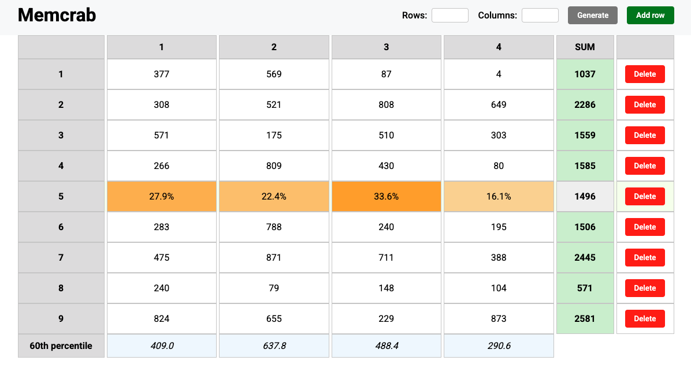

# Matrix App

A dynamic React application that allows users to interact with a matrix of numbers, visualize sums, percentages, and row-based heatmaps. Built with **React**, **TypeScript**, and **CSS Modules**.

---

## 📝 About

Matrix App is designed as a lightweight tool to explore and manipulate numeric data in a tabular format. Users can dynamically create matrices, increment values, delete or add rows, and instantly see both percentage calculations and row-based heatmaps.  
The application is optimized for performance using **React.memo**, **useMemo**, and **Context API**.

---

## 🚀 Features

- **Dynamic matrix generation** – create any number of rows and columns.
- **Increment cell values** – click a cell to increase its value.
- **Delete rows** – remove rows individually.
- **Add rows** – append new rows at the bottom.
- **Hover sum cell** – view percentages of each cell relative to the row total.
- **Row heatmap** – background intensity visualizes each cell's magnitude relative to the maximum in the row.
- **Column percentile footer** – see the 60th percentile for each column.
- Fully optimized for better performance.

---

## 🖼 Screenshots

  
_Hover on the sum cell to see percentages and the row heatmap._

---

## 💻 Installation

```bash
git clone https://github.com/NNaumenko83/memcrab-test.git
cd matrix
npm install
npm run dev

```

- Open your browser and navigate to **http://localhost:5173** to see the application in action.

## ⚡ Usage

- Add rows and columns to generate the matrix.

- Click on a cell to increment its value.

- Hover over a sum cell to see percentages and row heatmap.

- Delete rows using the "Delete" button at the end of each row.

## 🛠 Tech Stack

- **React** – UI library

- **TypeScript** – type-safe JavaScript

- **CSS Modules** – scoped styling

- **Vite** – fast development server and build tool

- **Context API** – state management
